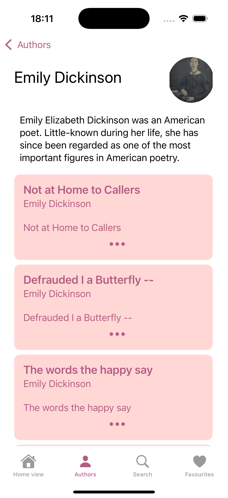

# Poetry App

An app to browse poems, search authors, and save favorite poems. This app uses the [PoetryDb API](https://poetrydb.org/) to fetch poems and the [Wiki API](https://www.mediawiki.org/wiki/API:Main_page) to get author information. Favorite poems are stored in `UserDefaults`.

## Features

- **Browse Poems**: View daily poems from various authors.
- **Search by Author**: Look up poems by specific authors.
- **Favorites**: Save your favorite poems for easy access.
- **Author Information**: Get biographical information about authors.

## Gallery

|  |  |
| ------------------------------------------------------------ | ------------------------------------------------------------ |
| Today's Poems Screen                                         | Poem Detail View                                               |

|  |  |
| --------------------------------------------------------------- | ------------------------------------------------------------- |
| Author's Screen                                                 | Search Screen                                              |

|  |  |
| ------------------------------------------------------------- | ------------------------------------------------------------- |
| Favorites Screen                                                 |                                                               |

## How to Use

1. **Home Screen**: View a selection of poems updated daily.
2. **Search**: Use the search feature to find poems by keyword or author.
3. **Author Detail**: Select an author to see a brief bio and a list of their poems.
4. **Favorites**: Add poems to your favorites, which are saved for easy access.
